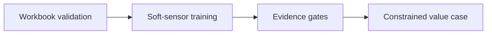

# KILNOMICS — Architecture and implementation

This guide follows the tracked implementation. Proposed work is identified separately.

## The problem and the system boundary

Cement operating comparisons can confuse plant size with efficiency and potential savings with
realised value. KILNOMICS keeps workbook inputs, intensive metrics, model evidence and constrained
scenarios visible so a value case can be reviewed before an operational decision.

## Processing path

## End-to-end behavior

### 1. Load the workbook

Use the synthetic demo first. The API validates workbook structure and usable data before fitting
or analysis.

### 2. Watch the stages

The background run exposes validation, training and analysis progress. A progress rail is tied to
backend stages, not a simulated loading story.

### 3. Inspect model evidence

Read sample size, input coverage, holdout results and release gates. A model that fails a gate
remains ineligible rather than becoming a recommendation by default.

### 4. Evaluate a scenario

Compare a TSR change against uploaded plant capability and fuel/cost inputs. Keep potential,
validated and finance-realised value as separate states.

## Design choices and consequences

### Intensive comparisons

Cross-plant comparisons avoid treating absolute scale as an efficiency gap.

### Model eligibility is explicit

Holdout evidence and gates stay visible to the reviewer.

### Value has distinct states

A modeled opportunity does not become a finance-realised saving automatically.

## Source entry points

### [backend/app/data_quality.py](../backend/app/data_quality.py)

- `SheetStatus` — Readiness record for one expected workbook sheet.
- `WorkbookStatus` — Visible data-quality evidence attached to a training run.
- `inspect_workbook` — Return sheet completeness and available daily-data span.
- `_sheet_statuses` — Implementation entry; inspect source for its exact behavior.
- `_sheet_state` — Implementation entry; inspect source for its exact behavior.
- `_date_coverage` — Implementation entry; inspect source for its exact behavior.

### [backend/app/training.py](../backend/app/training.py)

- `TargetReport` — Evaluation output and fitted model for one predictive target.
- `train_workbook` — Fit model candidates and return release-gated reports for every target.
- `_joined_features` — Implementation entry; inspect source for its exact behavior.
- `_merge_daily_cement` — Implementation entry; inspect source for its exact behavior.
- `_train_target` — Implementation entry; inspect source for its exact behavior.
- `_daily_average` — Average shift-level predictors before fitting daily laboratory targets.

### [backend/app/model_gate.py](../backend/app/model_gate.py)

- `ModelMetrics` — Temporal validation metrics for a single target model.
- `passes_release_gate` — Return whether all agreed model-release thresholds are satisfied.

### [backend/app/analysis.py](../backend/app/analysis.py)

- `analyze_workbook` — Return a traceable portfolio view for one uploaded workbook.
- `_provenance` — Implementation entry; inspect source for its exact behavior.
- `_plant_result` — Implementation entry; inspect source for its exact behavior.
- `_for_plant` — Implementation entry; inspect source for its exact behavior.
- `_structure_label` — Implementation entry; inspect source for its exact behavior.
- `_limits` — Implementation entry; inspect source for its exact behavior.

### [backend/app/main.py](../backend/app/main.py)

- `create_app` — Create the local-only API application.
- `_health` — Implementation entry; inspect source for its exact behavior.
- `_demo_workbook` — Implementation entry; inspect source for its exact behavior.
- `_train_workbook` — Implementation entry; inspect source for its exact behavior.
- `_start_training` — Implementation entry; inspect source for its exact behavior.
- `_training_status` — Implementation entry; inspect source for its exact behavior.

## Implementation state

| State | Evidence boundary |
| --- | --- |
| Present | Local workbook validation, training and analysis |
| Present | Intensive comparisons and constrained scenario source |
| Present | Synthetic workbook and behavioral test sources |
| Not validated | Real plant savings or autonomous kiln control |

“Present” means tracked source or assets exist. It does not mean a production or domain
validation has passed. See [Evaluation](EVALUATION.md) for reproducible checks and limits.
